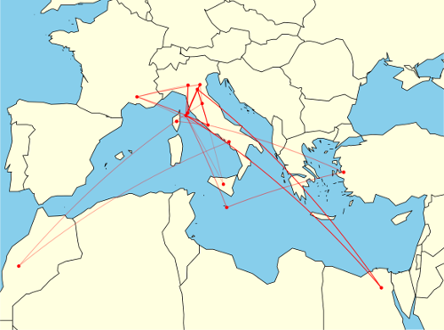
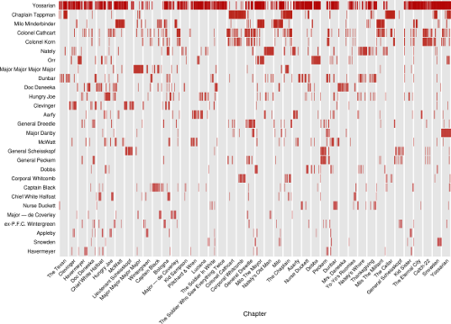
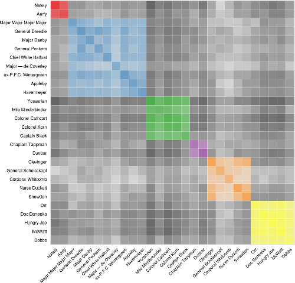
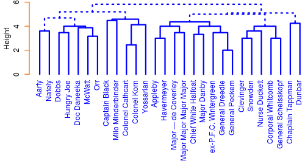
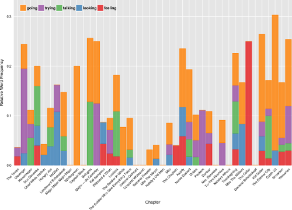

## Joseph Heller's Catch-22: Visualized ##

To run this app, please run the following code from R:

```
shiny::runGitHub('catch22', 'trevorstephens')
```

If you don't already have them, you may need to install the following packages first: `ggplot2`, `reshape2`, `scales`, `cluster`, `shiny`, `maps`, and `geosphere`.

## The Dataset ##

Catch 22 by Joseph Heller is my favorite novel. I recently finished reading it (again) and love the creative use of language and the ridiculous characters' interactions throughout the book. For my visualization class, it was an easy choice to select the text as my final project 'dataset'. The text has around 175,000 words, divided into 42 chapters. I found a raw text version of the book on the web and got to work.

I parsed the text in Python using a combination of regexes and simple string matches. The code for the iPython Notebook I built may be viewed here: http://nbviewer.ipython.org/urls/raw.githubusercontent.com/trevorstephens/catch22/master/Catch22.ipynb

The script first extracts the text from each chapter, converted to lower-case and punctuation-stripped. I then loop through a list of the main characters who appear more than 50 times and look for mentions of their name. I defined the 'time' of their appearances the percentile of the chapter, ie. a character that occurs at the 10th percentile of chapter three would be stored as 3.10. This dataset formed the basis for both the 'Character Appearances' and 'Character Co-Occurrences' plots.

A similar process was used to extract the occurrences of the various Mediterranean locations mentioned in the book. I found a fan site where all of the locations were listed, and searched for these names in the text. Once identified, the cities were geocoded using the `geopy` package in Python. This dataset was used for the 'Mediterranean Travels' visualization.

The final dataset was created by scanning the chapters for mentions of Yossarian. A window of the 25 words either side of these mentions was then collected and tagged with the chapter locations where they occurred. The `nltk` package in Python was used to both clean the word list of stopwords and then do part-of-speech tagging on the remainder. This dataset formed the basis of the 'Characteristic Words' visualization.

I visualized these data sets interactively with `shiny` in R. Wherever possible, I linked the interactivity between plots so that you can zoom into areas of interest.

### Mediterranean Travels ###



This visualization maps the mentions of the locations around the Mediterranean that are mentioned throughout the book. Aesthetically, I was very happy with the final product, the low-resolution border data from the `maps` package had an unexpected synergy with the original text, namely the jagged outline of a jumping soldier (Yossarian) on the cover. Hence I stuck with the low quality map data as I really liked the effect.

Clearly there is a temporal element to these journeys too, I indicate time by applying a linear fade in transparency which gives a hint as to the sequence of the mentions. The edges are plotted by their great circles which was really quite easy to implement using the `geosphere` package in R.

I feel that the visualization gives information about the book that may not have been totally clear during its reading. While I vividly remembered Milo's frantic trips about various merchant ports in Chapter 22, it is extremely interesting to *see* exactly how frantic it was, and feel sorry for Yossarian and Orr who were dragged along and deprived of sleep for days.

### Character Appearances ###



This plot essentially represents a time series of when different characters were mentioned in the book. It was inspired by the 'Character Mentions' plot by Jeff Clark's Novel Views: Les Miserables series available here: http://neoformix.com/2013/NovelViews.html

I plotted the data as a standard scatterplot with chapter as x-axis (since it is similar to time) and the characters as a discrete y-axis with a vertical bar as the marker.

I feel that every pixel in this visualization works hard. The lack of a 'dot' speaks just as loudly as its presence, especially for the prominent characters in the novel. I'm very happy to see patterns such as chapters heavy with their name-sake, and others almost devoid of the character they are named after. It was also interesting to see how some main characters really only showed up occasionally in the book, even if they left a lasting impression on the reader.

### Character Co-Occurences ###



This plot attempts to show which characters spend a lot of time together throughout the book. It was inspired by the 'Les Misérables Co-occurrence' plot by Mike Bostock available here: http://bost.ocks.org/mike/miserables/

The data used to build this visualization was the exact same as that used in the previous one, but required substantial transformation to get it into a form that could represent these patterns. Many different methods were examined to find when characters were co-located, but the one I settled on was when two characters were both merely present in a chapter. Looking for when characters were prominent (ie. both mentioned many times) ended up creating an extremely lop-sided view with more frequently appearing characters totally dominating the data. In fact, the co-location cell for Yossarian with himself was orders of magnitude higher than any other when other approaches were used.

Clustering added another dimension to this plot. A hierarchical clustering scheme is applied over the entire book to try and find communities among the characters. Again, presence in a chapter (1 for present, 0 for not) was used and a 42-dimensional euclidean distance used to cluster the characters with a complete-link AGNES algorithm. Manual inspection of the dendograms for different clustering schemes and distance measures found that this was the most 'level', in that more frequently appearing characters dominated the scheme the least. Here's the dendogram for six clusters:



When the user chooses to colour the plot by clusters, cells for the co-location of characters sharing the same cluster are filled with a unique colour while those cells showing co-location of characters from different communities are shaded grey. It should be noted that clustering is performed over the entire text, not the chapters being zoomed into by the user of the application. I felt that changing the clustering dynamically would be too distracting.

Alphabetic or frequency sorting 'explodes' the clusters into an unrecognizable space, but sorting by cluster brings them into their tight communities and lets the viewer see some of the interaction *between* clusters too.

My encoding of the co-location and mapping of shades applied to each cell would certainly be open to debate, and other methods of clustering result in very different communities being found. That said, qualitatively, I spent a lot of time evaluating the results with my own knowledge of the text and found that the current implementation was more satisfactory than any other I tested.

I found it incredibly interesting that every main character in the book at some time interacts with almost every other character. I wouldn't have expected so much overlap. Compared to Les Mis, the plot is much more dense, I suspect this is due to the 10-fold difference in the number of chapters being clustered over.

### Characteristic Words ###



This plot is probably the most conventional of the four plots, but potentially shows a lot of insights into the text all the same. As the word window surrounded mentions of Yossarian, I hoped that it would capture some of the changing emotions that our main character was feeling at different points in the book.

I used `NLTK`'s simplified POS tagging in order to get the most rich binning of word types, and allow the user to select the part-of-speech that they want to examine. Only the top few words in the word-type are shown, but this is recalculated as a chapter range is zoomed into. In this way, the words change as the user explores.

The word frequencies were normalized by the number of mentions Yossarian received in a given chapter. For example, if the word 'war' occurred 20 times in chapter 1, and Yossarian received 40 mentions in that chapter, a value of 0.5 would be assigned to that word. Thus, chapters with exceedingly high mentions of our main character would not receive a bias and more important words would rise to the top.

I give the option of choosing either a stacked bar or a stacked area plot for this visualization. I like how the stacked area plot better shows consecutive chapters where a word was prominent, but acknowledge that the triangular forms can distort the relationship when there is high variability between chapters. I do quite like the aesthetic of the landscape it presents though.

The dynamic recalculation of top words makes the plot different for every setting, and can give a wide range of insights depending on the selections. While many of the top words are uninteresting, and some are even misclassified by `NLTK`, there were several times when I found some very interesting words being prominent.

## Conclusion ##

I learnt a lot through this process, both in terms of using `Shiny`, as well as about the book itself. I'm extremely happy with the diverse visualizations that I created here, and hope that they are able to help others appreciate the book even more!
